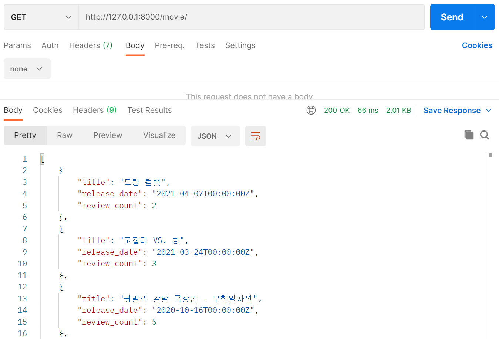
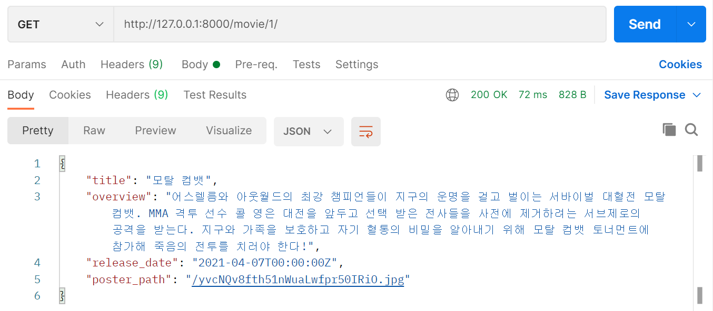
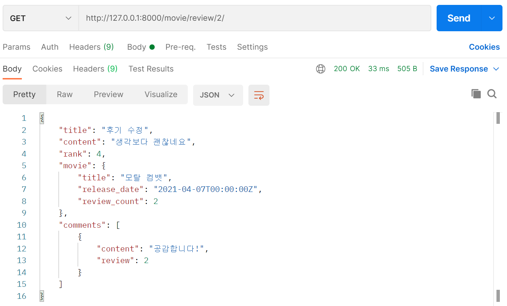
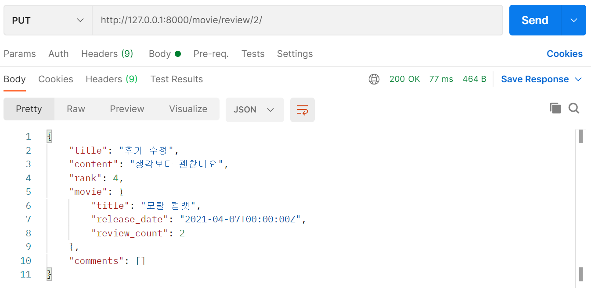
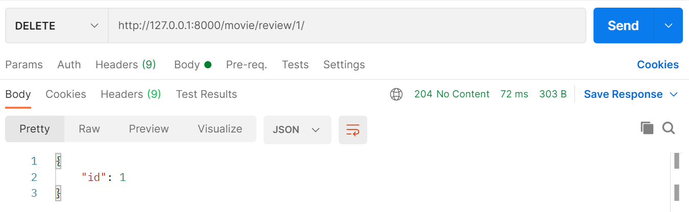
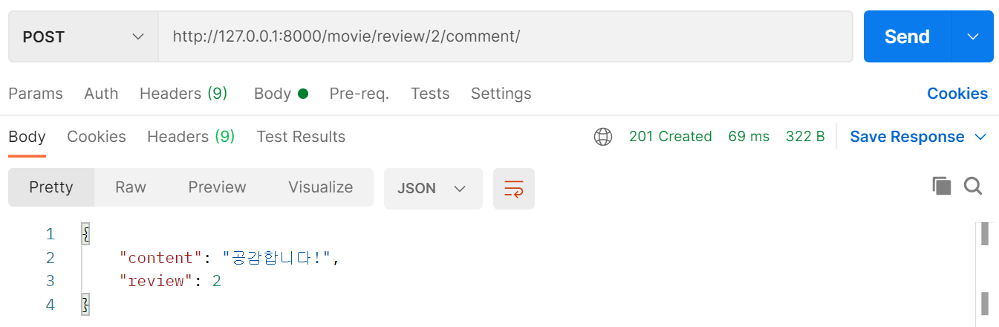
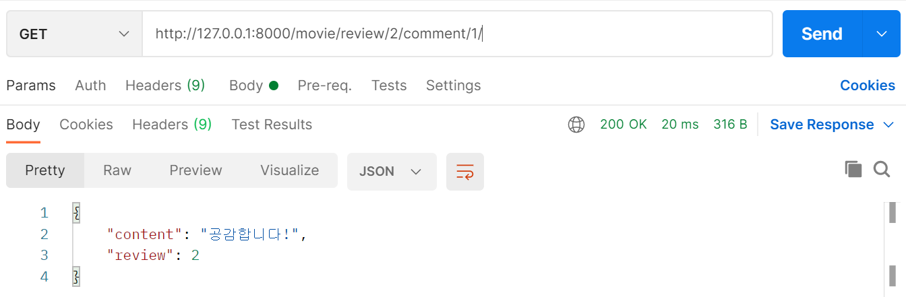

# Project 08_데이터베이스 설계를 통한 REST API 설계

## 0. 개발 환경

- Python 3.8.7
- Django 3.2
- SQLite3

## 1. 프로젝트 소개

- 진행 일시: 2021.04.30 (금)
- 프로젝트 내용
  - 데이터 생성, 조회, 수정, 삭제할 수 있는 API Server 제작
- 역할 분담: 페어인 권소영님과 `navigator` / `driver` 역할 번갈아가며 담당

## 2. 프로젝트 내용

[serializers.py 바로가기](movies/serializers.py)

[views.py 바로가기](movies/views.py)

### 1. Movie

> 전체 영화 목록 조회 / 단일 영화 정보 조회 시 사용하는 serializer를 각각 만들어서 적용했다.

1. `movie/` : 전체 영화 목록 조회

   - 영화제목 / 개봉날짜 외에 리뷰개수가 보이도록 설정했다.

     

2. `movie/<int:movie_pk>/` : 단일 영화 상세정보 조회

   - 영화의 모든 정보가 보이도록 설정했다.

     

### 2. Review

1. `movie/<int:movie_pk>/review/` : 리뷰 생성

   

2. `movie/review/<int:review_pk>` : 리뷰 정보 조회 / 수정 / 삭제

   1. 조회
      - 제목 / 내용 / 평점 외에 리뷰한 영화 정보 / 댓글 정보를 추가했다.

   

   2. 수정

      

   3. 삭제

      - 삭제한 리뷰의 id 값을 반환한다.

      

### 3. Comment

1. `movie/review/<int:review_pk>/comment/`: 댓글 생성

   

2. `movie/review/<int:reveiw_pk>/comment/<int:comment_pk>`: 댓글 조회

   - 명세에 있기 때문에 만들긴 했지만, 현실적으로 댓글을 단독으로 조회하지는 않는 것 같다. 그래서 단일 리뷰를 조회할 때 해당 리뷰에 달린 댓글들을 함께 조회할 수 있도록 설정했다.

   

### 4. 추가 구현

> Dummy data가 아닌 TMDB의 실제 데이터를 가져와서 DB에 저장했다.

1. `pjt02`를 참고하여 TMDB API key를 활용하여 url을 만들 수 있는 URLMaker를 생성한다.
2. 처음에는 전체 영화 목록을 조회하는 `movie_list` 함수에서 URLMaker로 만든 url에 요청을 보내서 받은 응답을 json으로 변환 후, 이를 Movie 모델에 저장도록 설정했다.
3. 하지만 문제점이 발생했다. 영화 목록을 조회하기 위해 `movie_list` 함수를 호출하는 url로 요청을 보낼 때마다 TMDB 서버에 요청을 보내고, 데이터가 새로 생성된다는 것이다.
4. 교수님께서 `load data`를 활용하면 된다고 말씀하셨으나, 이해가 잘 안 돼서 우선 `create_data` 함수를 따로 만들어서 한 번만 실행하여 DB에 데이터를 저장했다.

## 3. 후기

**💡 총평**

REST API 부분을 너무 짧게 하고 지나갔기 때문에 복습할 기회가 없어 아쉬웠는데, 이번 프로젝트를 하며 제대로 복습을 한 것 같다. 특히 페어인 소영님께 복잡한 부분을 설명해주면서 스스로 생각 정리를 할 수 있었다. 한편, 다양한 기능을 구현해서 상대적으로 재밌었던 지난 프로젝트와 달리 예쁜 화면 없이 무미건조한(?) json 데이터만을 다뤄서 아쉬웠다. 빨리 프론트엔드 프레임워크를 배워서 제대로 된 웹사이트를 구현해보고 싶다.

**🙂 잘한 점**: TMDB API를 활용해서 실제 데이터를 DB에 저장해본 것

**🙁 아쉬운 점**: 그 저장 과정이 조금 찝찝하게 끝난 것 같다. 함수를 실행할 필요 없이 바로 json 파일로 저장하는 방법은 없을까? 

